<p align="center">
  
</p>

# Teleport

Beam your Claude Code setup across machines.

Teleport is a Claude Code plugin that syncs your entire environment — plugins, skills, agents, rules, hooks, and settings — across machines using a private GitHub repo as a central hub.

## Quick Start

1. **Add the marketplace** in Claude Code:
   ```
   /install-marketplace https://github.com/seil/teleport
   ```

2. **Install the plugin**:
   ```
   /install-plugin teleport
   ```

3. **Initialize** on your first machine:
   ```
   /teleport-init
   ```

4. **Pull** on another machine:
   ```
   /teleport-pull
   ```

## Commands

| Command | Description |
|---------|-------------|
| `/teleport-init` | First-time setup: create private hub, export your config |
| `/teleport-pull` | Pull configs from hub to this machine |
| `/teleport-push` | Push local changes to hub |
| `/teleport-share` | Publish safe configs for others to import |
| `/teleport-from <user>` | Import from another user's public repo |

## How It Works

```
[Your Machine A]  --push-->  [claude-teleport-private]  <--pull--  [Your Machine B]
                              branch: macbook-pro
                              branch: work-imac
                              branch: main (merged)
                                     |
                                     v  /teleport-share
                             [claude-teleport-public]  <--from--  [Other Users]
                              branch: main (curated)
```

### Branch-based storage

Each machine gets its own **git branch**. When you push, your machine's branch is updated and then merged into `main`.

- `main` branch = union of all machines (merged)
- `macbook-pro` branch = Machine A's configs only
- `work-imac` branch = Machine B's configs only

When pulling, you choose which machine's branch to pull from — or use `main` for everything.

## What Gets Synced

- Plugins (install metadata)
- Skills, Agents, Rules, Commands
- Settings (credentials excluded)
- CLAUDE.md, AGENTS.md
- Hooks (with review gate)
- MCP configs
- Keybindings

## Safety

- Secrets auto-detected (AWS keys, GitHub tokens, PEM keys, etc.)
- `settings.local.json` and `.credentials.json` never synced
- Backup created before every apply operation
- RCE patterns flagged in imported hooks/agents
- All external imports require per-file content review

## Requirements

- Node.js >= 18
- GitHub CLI (`gh`) authenticated
- Claude Code

## License

MIT
